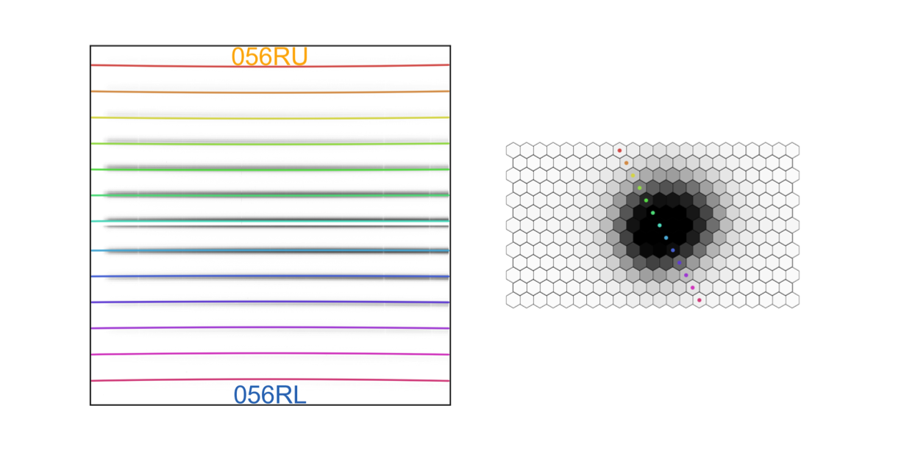
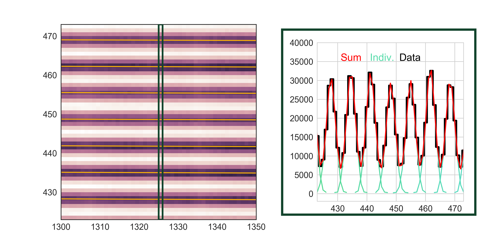

# Panacea 
This package is intended to be the base reduction pipeline for VIRUS and LRS2 at the Hobby Eberly Telescope.  
Instructions for installation and use at the Texas Advanced Computing Center (TACC) are below.

## Getting Started with LRS2

### Working on TACC 
The reductions are designed to be run on TACC where a copy of the raw data lives.  We will describe how to get started on TACC, 
acquire the reduction code, run the code, and the products that are produced.

#### Signing up for an account
https://portal.tacc.utexas.edu/
<p align="center">
  
</p>

After creating an accounting using the link above, please send Matthew Shetrone <shetrone@astro.as.utexas.edu> your 
TACC username and he will add you to the HET group.  When that step is complete, you can ssh into TACC using:
```
ssh -Y USERNAME@tacc.maverick.utexas.edu
```

#### Setting up your Python environment
To begin on TACC, point to the common python environment. In your home "~/.bashrc" file, add the following line at the bottom:
```
export PATH=”/home/00115/gebhardt/anaconda2/bin:/work/03946/hetdex/maverick/bin:$PATH”
```

#### Getting Panacea
Then move to your work directory and clone Panacea: 
```
cdw
git clone https://github.com/grzeimann/Panacea.git
```

#### Preparing the reductions
The next step is to generate the necessary set of scripts for your target:
```
python Panacea/build_panacea_call.py --start_date 20180515 --date_length 1 --rootdir /work/03946/hetdex/maverick --instrument lrs2 --side blue --target bd
```

The following scripts are generated from that call and printed to screen:
```
sbatch rtwi_blue_1.slurm
sbatch rsci_blue_1.slurm
sbatch rstd_blue_1.slurm
sbatch rresponse_blue_1.slurm
sbatch rcom_blue_1.slurm
```

At this step, it is easiest to create a new terminal on TACC to preserve these commands in your current window, and in the new 
terminal window you can run these scripts as described in detail below.

#### Running calibrations
We must first reduce the twilight frames from which the trace, fiber profile, wavelength solution, and fiber normalization are derived.
To begin, run all of the "rtwi_*.slurm" by simply copying and pasting the printed commands like "sbatch rtwi_blue_1.slurm" and hit enter.
If many "rtwi_*.slurm" commands are printed to the screen from the "python Panacea/build_panacea_commands.py" then copy them all
and hit enter. For example:
```
sbatch rtwi_blue_1.slurm
sbatch rtwi_blue_2.slurm
sbatch rtwi_blue_3.slurm
```

All of the "rtwi*" scripts can be run simultaneously and take roughly 30 minutes.  You can check on the progress by using the command:
```
squeue | grep USERNAME
```
Where you put your username for USERNAME.  The log of what is running or did run is in the file "reduction.oXXXXXX" 
where XXXXXX is the 6 job number (hint, the job number is printed out at the end of the command "sbatch rtwi_*.slurm").  

After the job has finished, in other words is no longer in the squeue, you can run both the science and standard star reductions.

#### Running basic reductions for science and standard star frames
Next, simply copy the "rsci*.slurm" and "rstd*.slurm" commands to the terminal window and hit enter:
```
sbatch rsci_blue_1.slurm
sbatch rstd_blue_1.slurm
```

Note, if you may have more than one rsci*.slurm or rstd*.slurm file generated you may run all of them in quick succession.  For example:
```
sbatch rsci_blue_1.slurm
sbatch rsci_blue_2.slurm
sbatch rsci_blue_3.slurm
sbatch rstd_blue_1.slurm
sbatch rstd_blue_2.slurm
sbatch rstd_blue_3.slurm
```

#### Combine amplifier reductions
We have reduced each amplifier individually, but each channel in LRS2 has two amplifiers, so we now must combine them.

To do so, run:
```
sbatch rcom_blue_1.slurm 
```
Again, do this for all commands generated by the initial "python Panacea/build_panacea_call.py".  
Now you are ready to look at the data products from the reduction.  

### Data Products
The primary data product are multi*{uv,orange,red,farred}.fits files for each channel that was reduced.  
The reductions reside in your "reductions/" folder at the same directory level that the "sbatch r*" commands were run.  
Within the "reductions/" directory are dates of the data reduced.  Under each date is each observation 
(either a twilight, science, or standard star).  To find what reductions you have done and the full path for each simply call:
```
python Panacea/find_my_reductions -f "reductions" -t TARGET_NAME -side blue
```
Change the "-side" argument to blue or red for LRS2-B and LRS2-R, respectively.
This will list the absolute path for a given date and observation for a target, including all exposures for the date and observation.

## Code Description
Panacea is a general integral field unit (IFU) spectroscopic reduction tool tailored specifically for the Hobby Eberly Telescope (HET).
The code is primarily used for reducing science data from the LRS2, VIRUS, and VIRUS-W instruments.  

<p align="center">
  
</p>

<p align="center">
  
</p>

<p align="center">
  
</p>

## Authors

* Greg Zeimann, UT Austin
* Karl Gebhardt, UT Austin

## NOTE
* COPYRIGHTS from astropy, free software foundation were used
* cosmics.py is a copy from Malte Tewes and Pieter van Dokkum's code available online: http://obswww.unige.ch/~tewes/cosmics_dot_py/
