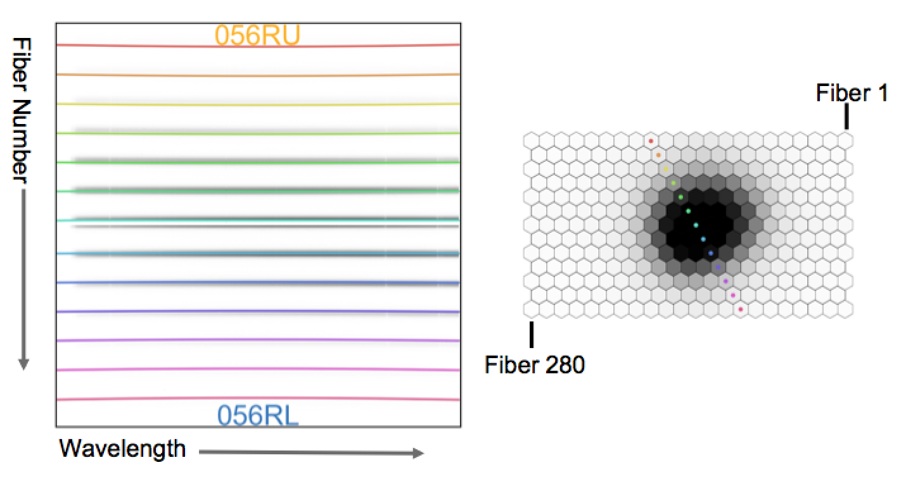
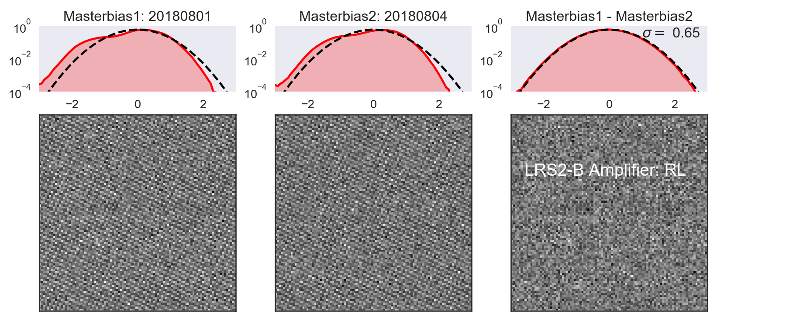

(NOTE: This is still in progress and will finish Jan/4/2019)
# Panacea v1.0 (Automatic LRS2 Pipeline)
This package the reduction pipeline for LRS2 observations at the Hobby Eberly Telescope. Every morning the pipeline reduces data taken the previous night.  Below we discuss the algorithms and products of Panacea, how to access your data reductions, and how to run the pipeline yourself with varying options. All of the data reduction products live on the Texas Advanced Computing Center (TACC).  We start with the instructions to log on to TACC, and where you reductions are placed.

## Working on TACC 
The reductions are designed to be run on TACC where a copy of the raw data lives.  We will describe how to get started on TACC,  where the automatic reduction products live, how to run the code yourself, and the products that are produced.

### Signing up for an account
https://portal.tacc.utexas.edu/
<p align="center">
  
</p>

After creating an accounting using the link above, please send Matthew Shetrone <shetrone@astro.as.utexas.edu> your TACC username and he will add you to the HET group.  When that step is complete, you can ssh into TACC using:
```
ssh -Y USERNAME@maverick.tacc.utexas.edu
```

## How to get your data
The reduction pipeline run each morning puts your data products in the following path:
```
/work/03946/hetdex/maverick/LRS2/PROGRAM-ID
```
where PROGRAM-ID, is your program number, for example HET19-1-999.  To get all of the current reductions for your program, simply:
```
scp -r username@maverick.tacc.utexas.edu:/work/03946/hetdex/maverick/LRS2/PROGRAM-ID .
```
You merely have to use your "username" and your "PROGRAM-ID" and you can copy over your products.  Now, the data reduction products are
extensive, that is to say they for every Mb of raw data there is 24 Mb of reduced data.  Without going into the data products yet,
you may just a single product or a single night.  Below is an example, which grabs all spectra within your program for a given data:
```
scp -r username@maverick.tacc.utexas.edu:/work/03946/hetdex/maverick/LRS2/PROGRAM-ID/spec*20190105*.fits .
```

## Data Products
There are three main data products: spectrum*.fits, multi*.fits, and *cube*.fits.  The first product, spectrum*.fits, 
is produced for all exposures and all channels.  Within the fits image, lie rows corresponding to different attributes. 
```
row1: wavelength
row2: extracted object spectrum (f_lambda: ergs/s/cm^2/A)
row3: extracted sky spectrum from same aperture and weighting as object (s_lambda: ergs/s/cm^2/A)
row4: error for extracted object spectrum (e_f_lambda: ergs/s/cm^2/A)
row5: error for extracted sky spectrum (e_s_lambda: ergs/s/cm^2/A)
row6: response function (ergs / e-)
```

The multi*{uv,orange,red,farred}.fits are multi-extension fits files and contain the following attributes:

```
Rectified Spectra:
Rectified Sky Model:
Rectified Sky Subtracted Spectra:
Rectified Error Frame:
Collapsed image:
Positions (IFU, Focal, Sky):
Extracted Spectra and Response:
ADR:
CCD Wavelength:
Image:
Flat Fielded image:
Central Trace Pixels:
Cosmics:
Unrectified Spectra:
```

### Running the reductions yourself
This section covers how to run your own reductions with modifications to achieve specific science objectives.

#### Setting up your Python environment
To begin on TACC, point to the common python environment. In your home "~/.bashrc" file, add the following line at the bottom:
```
export PATH=”/home/00115/gebhardt/anaconda2/bin:/work/03946/hetdex/maverick/bin:$PATH”
```

#### Getting Panacea
Then move to your work directory and clone Panacea: 
```
cdw
git clone https://github.com/grzeimann/Panacea.git
```


#### Preparing the reductions

## Code Description
Panacea is a general integral field unit (IFU) spectroscopic reduction tool tailored specifically for the Hobby Eberly Telescope (HET).
The code is primarily used for reducing science data from the LRS2 and VIRUS spectrographs.  
Before we dive into the details of the reduction code it is useful to visualize the mapping between 
raw data and on sky fiber layout for both instruments. 

### LRS2 Layout
The LRS2 instrument has two spectrographs each with two arms (LRS2-B: UV and Orange, LRS2-R: Red and FarRed).  
<p align="center">
  
</p>

### Bias Subtraction
The first step in Panacea's reduction is to measure the bias pedestal in the overscan region for each amplifier.  We subtract the pedestal row by row, excluding the first column in the overscan region using the remaining 31 or 63 pixels (2x1 or 1x1 binning, respectively) in a given row.  After the bias pedestal is removed, there remains a bias structure and excess charge that still needs to be removed. Each night, twenty bias exposures are taken, which are insufficient to accurately measure the low-level structure, so we use 100 consecutive frames over 5-6 nights, which is a compromise between sufficient statitics and minimal evolution of the structure from the passage of time.  The evolution of the bias structure depends on temperature control and the intricacies of each amplifier's controller. 

The quality of the bias subtraction is demonstrated in two ways: subtracting consecutive master bias frames from one another and looking at "blank" areas of science frames for residual counts and structure.  

<p align="center">
  
</p>

<p align="center">
  
</p>

## Authors

* Greg Zeimann, UT Austin
* Karl Gebhardt, UT Austin

## NOTE
* COPYRIGHTS from astropy, free software foundation were used
* cosmics.py is a copy from Malte Tewes and Pieter van Dokkum's code available online: http://obswww.unige.ch/~tewes/cosmics_dot_py/
