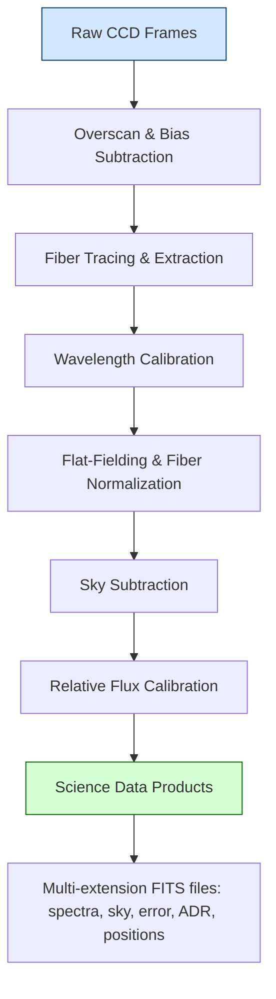

# Panacea v1.0 (Automatic LRS2 Pipeline)
## Table of Contents
[Overview](https://github.com/grzeimann/Panacea/blob/master/README.md#Overview)

[TACC](https://github.com/grzeimann/Panacea/blob/master/README.md#Working-on-TACC)

[Data Access](https://github.com/grzeimann/Panacea/blob/master/README.md#How-to-get-your-data)

[Data Products](https://github.com/grzeimann/Panacea/blob/master/README.md#Data-Products)

[Running Panacea](https://github.com/grzeimann/Panacea/blob/master/README.md#Running-the-reductions-yourself)

[Panacea: the code](https://github.com/grzeimann/Panacea/blob/master/README.md#Code-Description)

[FAQ](https://github.com/grzeimann/Panacea/blob/master/README.md#frequently-asked-questions)

[JOSS readiness checklist](https://github.com/grzeimann/Panacea/blob/master/JOSS_CHECKLIST.md)

[Contributing and community guidelines](#contributing-and-community-guidelines)


## Overview
Panacea is the LRS2 data-reduction pipeline for the Hobby–Eberly Telescope. It is primarily operated as a daily, automated pipeline on the Texas Advanced Computing Center (TACC), but it can also be installed and run locally for development or small analyses.

This README explains:
- How Panacea runs on TACC (recommended for full-scale reductions)
- How to install and run Panacea locally (for development and small jobs)
- What data products are produced
- High-level details of the algorithms implemented

## Install & Quickstart

Panacea can be used in two modes:
- TACC pipeline: preferred for performance, storage, and access to the HET raw-data layout
- Local machine: for development, testing, and small reductions if you mirror the expected data layout

Dependencies
- Python 3.9+
- NumPy, SciPy, Astropy, Matplotlib, PyYAML, tqdm, requests, scikit-learn (installed automatically from PyPI)
- pyhetdex (optional, needed for astrometric mapping via the fplane). Install from a private index:
  pip install --extra-index-url https://gate.mpe.mpg.de/pypi/simple/ pyhetdex

Option A: Local install using conda + pip
```
conda env create -f environment.yml
conda activate panacea
# Install pyhetdex from the private index if you want astrometric mapping
pip install --extra-index-url https://gate.mpe.mpg.de/pypi/simple/ pyhetdex
pip install . --no-deps
```

Quickstart (local)
```
# Show CLI help and verify installation
panacea-lrs2 -h

# Examples (adjust args to your data)
# Reduce Far Red for a specific date
panacea-lrs2 -d 20251016 -s farred
# Reduce UV for a specific date
panacea-lrs2 -d 20181108 -s uv
```

Notes for local runs
- The quicklook runner expects HET raw data in a TACC-like directory structure (tarballs with standard internal paths). Use the --baseraw option to point Panacea to your local mirror of the LRS2 raw data. For example: --baseraw /data/LRS2. 
- Packaged configuration files (line lists, DAR tables, fplane.txt, responses) are bundled with the package and found automatically via importlib.resources.

Troubleshooting
- If pyhetdex installation fails, ensure you included the --extra-index-url parameter and have network access to gate.mpe.mpg.de.
- Some steps require significant memory/storage; consider running on TACC as described below.


## Working on TACC (for HET Users only)
The reductions are designed to run on the Texas Advanced Computing Center (TACC), where a full copy of the raw data is stored. An automated pipeline executes each morning at 10 a.m. Central Time and has been operating continuously since January 1, 2019. In the following sections, we describe how to get started on TACC, where to find the automatic reduction products, how to run the code manually, and what data products the pipeline generates.
### Signing up for an account
https://portal.tacc.utexas.edu/
<p align="center">
  
</p>

After creating an accounting using the link above, please send Greg Zeimann <gregz@astro.as.utexas.edu> your TACC username and he will add you to the HET group.  When that step is complete, you can ssh into TACC using:
```
ssh -Y USERNAME@ls6.tacc.utexas.edu
```

## How to get your data
The reduction pipeline run each day puts your data products in the following path:
```
/work/03946/hetdex/maverick/LRS2/PROGRAM-ID
```
where PROGRAM-ID, is your program number, for example HET19-1-999.  To get all of the current reductions for your program, simply:
```
scp -r username@ls6.tacc.utexas.edu:/work/03946/hetdex/maverick/LRS2/PROGRAM-ID .
```
You merely have to use your "username" and your "PROGRAM-ID" and you can copy over your products.  Now, the data reduction products are
extensive, that is to say they for every Mb of raw data there is 24 Mb of reduced data.  Without going into the data products yet,
you may just a single product or a single night.  Below is an example, which grabs all spectra within your program for a given data:
```
scp username@ls6.tacc.utexas.edu:/work/03946/hetdex/maverick/LRS2/PROGRAM-ID/spec*20190105*.fits .
```

## Data Products
There are three main data products: spectrum*.fits, multi*.fits, and *cube*.fits.  The first product, spectrum*.fits, 
is produced for all exposures and all channels.  Within the fits image, lie rows corresponding to different attributes. 
```
row1: wavelength (air)
row2: extracted object spectrum (f_lambda: ergs/s/cm^2/A)
row3: extracted sky spectrum from same aperture and weighting as object (s_lambda: ergs/s/cm^2/A)
row4: error for extracted object spectrum (e_f_lambda: ergs/s/cm^2/A)
row5: error for extracted sky spectrum (e_s_lambda: ergs/s/cm^2/A)
row6: response function (ergs / e-)
```

The multi*{uv,orange,red,farred}.fits are multi-extension fits files and contain the following attributes:

```
Rectified Spectra: flux calibrated spectrum (object + sky) for each fiber
Rectified Sky Model:flux calibrated sky spectrum for each fiber
Rectified Sky Subtracted Spectra: flux calibrated sky subtracted spectrum for each fiber
Rectified Error Frame: flux calibrated error spectrum for each fiber
Collapsed image: a collapsed frame for visualization of the source(s)
Positions (IFU, Focal, Sky): ifu x and y positions, focal x and y position, and ra and dec
Extracted Spectra and Response: This is identical to the spectrum*.fits extension above
ADR: The atmospheric differential refraction as a function of wavelength.  The columns are wavelength, x_adr, y_adr
CCD Wavelength: The wavelength of each pixel in the 2d frame
Image: the initial reduction of the 2d raw frame.
Flat Fielded image: same as the image frame above but divided by the flat field (fiber profile and fiber to fiber normalization)
Central Trace Pixels: location of the pixels for each fiber (central two pixels)
Cosmics: identified cosmics in the central four pixels of the trace
Unrectified Spectra: Unrectified, uncalibrated spectra for each fiber
```

## Running the reductions yourself on TACC
This section covers how to run your own reductions with modifications to achieve specific science objectives.

### Setting up your Python environment
To begin on TACC, point to the common python environment. In your home "~/.bashrc" file, add the following line at the bottom:
```
export PATH=/home/00115/gebhardt/anaconda2/bin:/work/03946/hetdex/maverick/bin:$PATH
```

### Running Panacea in the command line
On TACC, create an interactive development session (one CPU) to explore and run the CLI:
```
idev
```

Now check the Panacea CLI options (the console script is installed as part of the package):
```
panacea-lrs2 -h
```

Key options you may use include:
- -d/--date YYYYMMDD (required) — date of observations
- -s/--sides uv,orange,red,farred — which channels to reduce (comma-separated)
- -o/--object NAME — filter to targets whose OBJECT header contains NAME
- --use_flat — prefer internal flats over twilight
- --correct_ftf — apply fiber-to-fiber correction
- --central_wave, --wavelength_bin, --source_x, --source_y — control source-finding/extraction window
- --standard_star_date, --standard_star_obsid — derive a response from a specific standard

If you want to reduce a given object on a given night you can use the following options:

```
panacea-lrs2 -d DATE -o TARGET_NAME -s uv
```

You can reduce any side you want, above I choose the "uv" channel, and the TARGET_NAME only has to be in the full name of the target
(e.g., HD which is in HD_19445_056_E).

### Running Panacea in batch
To run a reduction of a given target on a given date for all four channels simply:
```
cdw
cp /work/03946/hetdex/maverick/run_lrs2/runlrs2general .
runlrs2general DATE TARGET_NAME
```

You will see an immediate output like:
```
----------------------------------------------------------------
          Welcome to the Maverick Supercomputer                 
----------------------------------------------------------------

No reservation for this job
--> Verifying valid submit host (login2)...OK
--> Verifying valid jobname...OK
--> Enforcing max jobs per user...OK
--> Verifying availability of your home dir (/home/03730/gregz)...OK
--> Verifying availability of your work dir (/work/03730/gregz/maverick)...OK
--> Verifying valid ssh keys...OK
--> Verifying access to desired queue (gpu)...OK
--> Verifying job request is within current queue limits...OK
--> Checking available allocation (Hobby-Eberly-Telesco)...OK
Submitted batch job 900134
```

This means you successfully submitted your job to the supercomputer and the reductions are in progress.  You can see the log of the 
reductions in the file "reductionlrs2daily.oXXXXXX" where the XXXXXX is the job number as shown above in the line 
"Submitted batch job 900134".  The reductions should finish in 20 minutes or so depending on computer availability 
and number of exposures of the target.  The simplest way to see the effectiveness of the reduction is look at the source extraction
information in the log.

```
cat reductionlrs2daily.oXXXXXX | grep source
```

If you would like more flexibility in your batch processing, you can always edit "rlrs2_daily" to run any four reduction 
call you may want and submit the job manually with:
```
sbatch rgeneral_lrs2.slurm
```

The reductions will be in "LRS2/ORPHANS" for reductions before 2018/07/01 and in "LRS2/PROGRAM-ID" for reductions after this date.
The standard stars will be in "LRS2/STANDARDS" and the calibrations used are in "LRS2/CALS".  


## Code Description

Panacea is a comprehensive, modular reduction pipeline for the **LRS2** integral-field spectrograph on the **Hobby–Eberly Telescope (HET)**.  
It automates the complete CCD-to-calibrated-spectra workflow for all four channels (UV, Orange, Red, and Far Red) and is designed for parallel execution on TACC systems.  The pipeline implements CCD preprocessing, fiber tracing, extraction, wavelength calibration, and flux calibration tuned to the dual-arm, multi-amplifier, fiber-fed design of LRS2.

---

### LRS2 Layout
LRS2 provides integral-field-unit (IFU) spectroscopy using 280 0.6"-diameter lenslets that cover a 12"x6" field of view (FOV) on the sky. LRS2 is composed of two arms: blue (LRS2-B) and red (LRS2-R). The LRS2-B arm employs a dichroic beamsplitter to send light simultaneously into two spectrograph units: the "UV" channel (covering 3640--4645A at resolving power 1910), and the "Orange" channel (covering 4635--6950A at resolving power 1140).  The LRS2-R is also split into two spectrograph units: the "red" channel (covering 6450--8450A at resolving power 1760), and the "Farred" channel (covering 8250--10500A at resolving power 1920).

<p align="center">
  
</p>

---

### 1. Overscan and Bias Subtraction
Each CCD frame is first corrected for electronic bias by fitting and subtracting the **overscan level** independently for each amplifier.  Panacea excludes the first column of the overscan region and uses the remaining 31 or 63 pixels per row (depending on binning) to determine the row-by-row bias pedestal.  Residual two-dimensional bias structure is removed using a **master bias**, constructed from ∼100 bias frames across several nights to achieve high S/N while minimizing temporal drift.  This process removes amplifier offsets and pattern noise before flat-fielding.

<p align="center">
  
</p>

---

### 2. Fiber Tracing and Extraction
Using the master flat, Panacea identifies and traces each fiber’s centroid along the dispersion axis.  The fiber positions are modeled as smooth polynomials describing their curvature across the CCD.  1D spectra are then extracted using an **optimal extraction algorithm**, which weights by the spatial fiber profile and local variance.  Cosmic rays are flagged and rejected using a similar algorithm to that of Malte Tewes and Pieter van Dokkum.

<p align="center">
  
</p>

---

### 3. Wavelength Calibration
Wavelength solutions are derived from **arc-lamp exposures** (Hg, Cd, Ne, Ar, Fe) taken near in time to the science frames.  Line identifications for each fiber are matched to laboratory wavelengths, and Panacea fits a polynomial dispersion solution (typically 3rd order).  These solutions are refined per amplifier and per spectrograph channel, ensuring internal consistency between the LRS2 arms.  The wavelength calibration is applied to all extracted spectra and rectified data products.

---

### 4. Flat-Fielding and Fiber Normalization
Twilight or internal flat exposures are used to model the **fiber profiles** and correct both pixel-to-pixel and fiber-to-fiber throughput variations.  The normalized flat defines a *fiber profile model* that traces the flux distribution of each fiber across the CCD.  Panacea supports both **fiber-to-fiber (FTF)** correction and optional **use_flat** flags for selecting twilight versus internal flats.  Flat-fielding also corrects for wavelength-dependent sensitivity variations within each fiber.

---

### 4. Sky Subtraction

Panacea constructs a two-dimensional sky model for each exposure and subtracts it from the rectified fiber spectra. The approach is empirical and robust against faint sources, using only sky-dominated pixels to model spatial and spectral structure.

**Algorithm overview**

1. **Identify sky fibers and build a median template**  
   - The median flux is computed for each fiber, and those with the lowest background levels are flagged as “sky-like.”  
   - These fibers are used to form an initial 1D median sky template across wavelength.  
   - A smoothed continuum version of this template is created by convolving with a broad Gaussian kernel.  
   - Significant deviations between the original and smoothed spectra identify bright sky-line regions.

2. **Per-fiber scaling of the sky template**  
   - For each fiber, Panacea determines a scalar that best scales the global sky template to match the fiber’s data at sky-line wavelengths.  
   - A grid of trial scale factors (0.7–1.3) is tested, and the best value minimizes residuals between the observed and template spectra.  
   - This yields a set of per-fiber scale factors that represent spatial variation of the sky intensity across the IFU.

3. **Normalize by amplifier and fit a smooth 2D field model**  
   - Since LRS2 channels are split into two amplifiers (140 fibers per amplifiers), Panacea normalizes scale factors within each arm separately to remove global offsets.  
   - A 2D polynomial (degree 2) is then fit to the normalized scale factors as a function of the fibers’ focal-plane coordinates (x, y).  
   - Outliers more than twice the median absolute deviation from the fit are rejected, and the model is refit for stability.

4. **Construct the final fiber-resolved sky model**  
   - The initial 1D sky template is multiplied by the fitted 2D surface to form a full fiber-by-fiber sky model.  
   - This reproduces both spectral and spatial variations in the background illumination.

5. **Subtract and propagate**  
   - The modeled sky spectrum is subtracted from each fiber’s rectified spectrum.  
   - Errors are propagated consistently, and flagged bad fibers or masked pixels are set to zero.  
   - The resulting arrays include the observed spectra, modeled sky, and sky-subtracted spectra for downstream analysis.

**Notes and diagnostics**

- The method emphasizes sky-dominated fibers and bright sky lines, avoiding bias from object flux.  
- The polynomial surface ensures smooth spatial variation across the IFU.   
- Panacea’s multi-extension FITS outputs include both the rectified sky model and the sky-subtracted spectra for quality assurance.

---

### 5. Relative Flux Calibration
An initial **relative flux calibration** is computed using the default LRS2 response curves derived from spectrophotometric standard stars.  Panacea scales these curves based on estimates of **telescope illumination** and **exposure throughput**, as measured from **guide-camera photometry** of field stars.  This process compensates for night-to-night transparency and mirror reflectivity variations, yielding consistent relative flux scales between nights and between channels.

---

### 6. Final Data Products
Each reduction produces multi-extension FITS files containing:
- Fiber-extracted, wavelength- and flux-calibrated spectra  
- Sky and sky-subtracted spectra  
- Error frames and response curves  
- Fiber position tables (IFU, focal-plane, and sky coordinates)  
- Collapsed images and atmospheric differential refraction (ADR) tables  
- Rectified and unrectified 2D spectra for visualization and diagnostics  

These products form the complete foundation for LRS2 science analysis and are automatically archived and accessible via TACC.

---

### 7. Reduction Flow Diagram



### Citation

A paper describing Panacea in detail is currently in draft.  Until the submission of the paper, authors can use the following short blurb for their work if they desire.  Contact Greg Zeimann (gregz@astro.as.utexas.edu) if you require more details.

```
The raw LRS2 data are initially processed with \texttt{Panacea}\footnote{\url{https://github.com/grzeimann/Panacea}}, which carries out bias
subtraction, dark subtraction, fiber tracing, fiber wavelength evaluation, fiber extraction, fiber-to-fiber normalization, source detection, source
extraction, and flux calibration for each channel. The absolute flux calibration comes from default response curves and measures of the mirror illumination
as well as the exposure throughput from guider images.
```


## Frequently Asked Questions

Q: Are the wavelength units in vacuum or air?

A: Air

Q: Do I need pyhetdex installed?

A: Not strictly. If pyhetdex is not installed, Panacea will still run and produce core products. Astrometric features that rely on the fplane (e.g., mapping IFU positions to RA/Dec and focal-plane coordinates) will be disabled gracefully; you will see a warning at runtime. If you do install pyhetdex, Panacea will automatically use the packaged fplane.txt to enable these features.

## Contributing and community guidelines

We welcome contributions of bug reports, feature requests, and pull requests.

- CONTRIBUTING.md: Describes how to set up a development environment, coding style, and how to propose changes via issues and pull requests.
- CODE_OF_CONDUCT.md: Outlines our expectations for a welcoming, inclusive community. By participating, you agree to abide by this code.

Please read both documents before opening an issue or submitting a PR.

## Authors

* Greg Zeimann, UT Austin


## Running tests

You can run the test suite locally with pytest. The project includes a minimal set of tests that verify:
- The CLI console script panacea-lrs2 responds to -h
- Packaged resources (lrs2_config) are discoverable and readable
- A base raw data directory exists (either from the repo’s LRS2/ folder or via PANACEA_BASERAW)

Quickstart

1) Create/activate an environment and install Panacea with dev extras

```
# Using conda (optional but recommended)
conda env create -f environment.yml
conda activate panacea

# Install optional dependency for astrometry (if needed)
pip install --extra-index-url https://gate.mpe.mpg.de/pypi/simple/ pyhetdex

# Install panacea in editable mode with test tools
pip install -e .[dev]
```

2) Ensure tests can locate raw data

- By default, tests look for a base raw-data directory in one of two places:
  - Environment variable PANACEA_BASERAW pointing to your local LRS2 raw-data mirror, or
  - The repo-local LRS2/ folder included with the source tree.

If you have a mirror elsewhere, set:

```
export PANACEA_BASERAW=/path/to/your/LRS2
```

3) Run the tests

```
# Run all tests quietly
pytest -q

# Verbose output
pytest -vv

# Run a single test module
pytest tests/test_cli.py -q

# Collect coverage (optional)
pytest --cov=panacea --cov-report=term-missing
```

Notes
- The tests add the repository’s src directory to sys.path automatically via tests/conftest.py, so you don’t need to install the package just to import panacea when running pytest from a source checkout.
- If you see failures related to missing raw-data nights, set PANACEA_BASERAW to a directory containing LRS2 tarballs, or ensure the repo’s LRS2/ directory is present.
