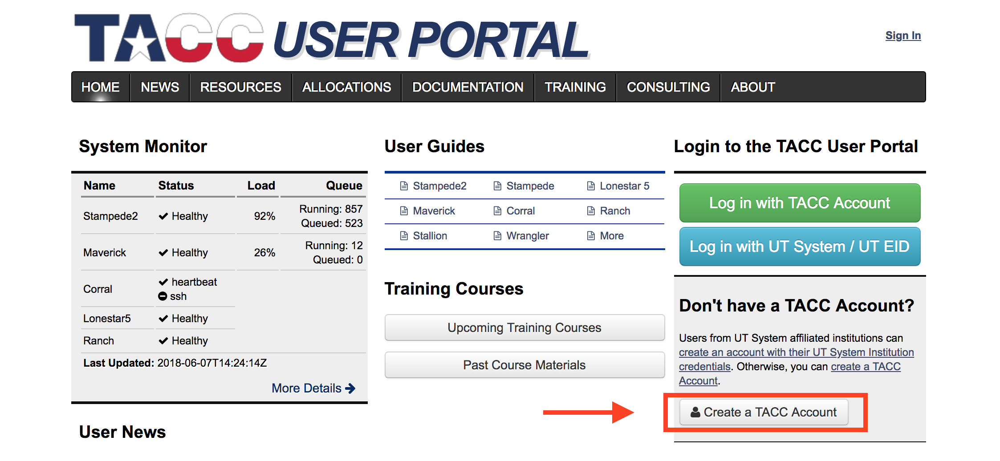

# Panacea 
This package is intended to be the base reduction pipeline for VIRUS and LRS2 at the Hobby Eberly Telescope.  Instructions for installation and use at the Texas Advanced Computing Center (TACC) are below.

## Getting Started with LRS2
### TACC 
#### Signing up for an account
https://portal.tacc.utexas.edu/
<p align="center">
  
</p>

After creating an accounting using the link above, please send Matthew Shetrone <shetrone@astro.as.utexas.edu> your TACC username and he will add you to the HET group.

To begin on TACC, point to the common python environment. In your home "~/.bashrc" file, add the following line at the bottom:
```
export PATH=”/home/00115/gebhardt/anaconda2/bin:/work/03946/hetdex/maverick/bin:$PATH”
```

Then move to your work directory and clone Panacea: 
```
cdw
git clone https://github.com/grzeimann/Panacea.git
```

The next step is to generate the necessary set of scripts for your target:
```
python Panacea/build_panacea_call.py --start_date 20180515 --date_length 1 --rootdir /work/03946/hetdex/maverick --instrument lrs2 --side blue --target bd
```

The following scripts are generated from that call and printed to screen:
```
sbatch rtwi_blue_1.slurm
sbatch rsci_blue_1.slurm
sbatch rstd_blue_1.slurm
sbatch rresponse_blue_1.slurm
```

First run all of the "rtwi_*.slurm" by simply copying and pasting the printed commands like "sbatch rtwi_blue_1.slurm" and hit enter.  All of the "rtwi*" scripts can be run simultaneously and take roughly 30 minutes.  You can check on the progress by using the command:
```
squeue | grep USERNAME
```
Where you put your username for USERNAME.  The log of what is running or did run is in the file "reduction.oXXXXXX" where XXXXXX is the 6 job number (hint, the job number is printed out at the end of the command "sbatch rtwi_*.slurm").  

After the job has finished, in other words is no longer in the squeue, you can run both the science and standard star reductions via:
```
sbatch rsci_blue_1.slurm
sbatch rstd_blue_1.slurm
```

Note, if you may have more than one rsci*.slurm or rstd*.slurm file generated you may run all of them in quick succession.  For example:
```
sbatch rsci_blue_1.slurm
sbatch rsci_blue_2.slurm
sbatch rsci_blue_3.slurm
sbatch rstd_blue_1.slurm
sbatch rstd_blue_2.slurm
sbatch rstd_blue_3.slurm
```

### Data Products
The primary data product are multi*.fits files for each channel that was reduced.  The reductions reside in your "reductions/" folder at the same directory level that the "sbatch r*" commands were run.  Within the "reductions/" directory are dates of the data reduced.  Under each date is each observation (either a twilight, science, or standard star).  To find what reductions you have done and the full path for each simply call:
```
python Panacea/find_my_reductions -f "reductions" -t TARGET_NAME -side blue
```
Change the "-side" argument to blue or red for LRS2-B and LRS2-R, respectively.
This will list the absolute path for a given date and observation for a target, including all exposures for the date and observation.


### Authors

* Greg Zeimann, UT Austin
* Karl Gebhardt, UT Austin

#### NOTE
* COPYRIGHTS from astropy, free software foundation were used
* cosmics.py is a copy from Malte Tewes and Pieter van Dokkum's code available online: http://obswww.unige.ch/~tewes/cosmics_dot_py/
