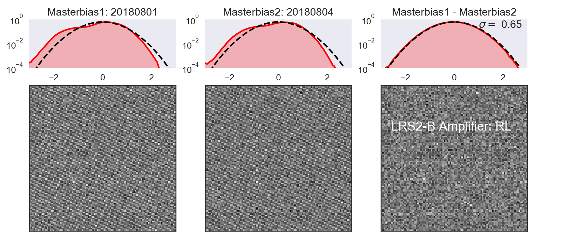

# Algorithms Overview

This page provides a high-level overview of the reduction steps implemented in Panacea. Detailed implementation notes live in the code; this page is intended as a conceptual guide.

---

## LRS2 Layout
LRS2 provides integral-field-unit (IFU) spectroscopy using 280 0.6"-diameter lenslets that cover a 12"×6" field of view (FOV) on the sky. LRS2 is composed of two arms: blue (LRS2-B) and red (LRS2-R). The LRS2-B arm employs a dichroic beamsplitter to send light simultaneously into two spectrograph units: the "UV" channel (covering 3640–4645 Å at resolving power 1910), and the "Orange" channel (covering 4635–6950 Å at resolving power 1140). The LRS2-R is also split into two spectrograph units: the "Red" channel (covering 6450–8450 Å at resolving power 1760), and the "Far Red" channel (covering 8250–10500 Å at resolving power 1920).


---

## 1. Overscan and Bias Subtraction
Each CCD frame is first corrected for electronic bias by fitting and subtracting the overscan level independently for each amplifier. Panacea excludes the first column of the overscan region and uses the remaining 31 or 63 pixels per row (depending on binning) to determine the row-by-row bias pedestal. Residual two-dimensional bias structure is removed using a master bias, constructed from ~100 bias frames across several nights to achieve high S/N while minimizing temporal drift. This process removes amplifier offsets and pattern noise before flat-fielding.



---

## 2. Fiber Tracing and Extraction
Using the master flat, Panacea identifies and traces each fiber’s centroid along the dispersion axis. The fiber positions are modeled as smooth polynomials describing their curvature across the CCD. 1D spectra are extracted following the "flat-relative optimal extraction" (Zechmeister et al. 2014, A&A, 561, A59), in which the science frame is divided by a normalized flat before extraction to mitigate pixel-response variations and achieve optimal weighting. Cosmic rays are flagged and rejected using a similar algorithm to that of Malte Tewes and Pieter van Dokkum.


---

## 3. Wavelength Calibration
Wavelength solutions are derived from arc-lamp exposures (Hg, Cd, Ne, Ar, Fe) taken near in time to the science frames. Line identifications for each fiber are matched to laboratory wavelengths, and Panacea fits a polynomial dispersion solution (typically 3rd order). These solutions are refined per amplifier and per spectrograph channel, ensuring internal consistency between the LRS2 arms. The wavelength calibration is applied to all extracted spectra and rectified data products.

---

## 4. Flat-Fielding and Fiber Normalization
Twilight or internal flat exposures are used to model the fiber profiles and correct both pixel-to-pixel and fiber-to-fiber throughput variations. The normalized flat defines a fiber profile model that traces the flux distribution of each fiber across the CCD. Panacea supports both fiber-to-fiber (FTF) correction and optional use_flat flags for selecting twilight versus internal flats. Flat-fielding also corrects for wavelength-dependent sensitivity variations within each fiber.

---

## 5. Sky Subtraction
Panacea constructs a two-dimensional sky model for each exposure and subtracts it from the rectified fiber spectra. The approach is empirical and robust against faint sources, using only sky-dominated pixels to model spatial and spectral structure.

Algorithm overview
1. Identify sky fibers and build a median template
   - The median flux is computed for each fiber, and those with the lowest background levels are flagged as “sky-like.”
   - These fibers are used to form an initial 1D median sky template across wavelength.
   - A smoothed continuum version of this template is created by convolving with a broad Gaussian kernel.
   - Significant deviations between the original and smoothed spectra identify bright sky-line regions.
2. Per-fiber scaling of the sky template
   - For each fiber, Panacea determines a scalar that best scales the global sky template to match the fiber’s data at sky-line wavelengths.
   - A grid of trial scale factors (0.7–1.3) is tested, and the best value minimizes residuals between the observed and template spectra.
   - This yields a set of per-fiber scale factors that represent spatial variation of the sky intensity across the IFU.
3. Normalize by amplifier and fit a smooth 2D field model
   - Since LRS2 channels are split into two amplifiers (140 fibers per amplifier), Panacea normalizes scale factors within each arm separately to remove global offsets.
   - A 2D polynomial (degree 2) is then fit to the normalized scale factors as a function of the fibers’ focal-plane coordinates (x, y).
   - Outliers more than twice the median absolute deviation from the fit are rejected, and the model is refit for stability.
4. Construct the final fiber-resolved sky model
   - The initial 1D sky template is multiplied by the fitted 2D surface to form a full fiber-by-fiber sky model.
   - This reproduces both spectral and spatial variations in the background illumination.
5. Subtract and propagate
   - The modeled sky spectrum is subtracted from each fiber’s rectified spectrum.
   - Errors are propagated consistently, and flagged bad fibers or masked pixels are set to zero.
   - The resulting arrays include the observed spectra, modeled sky, and sky-subtracted spectra for downstream analysis.

Notes and diagnostics
- The method emphasizes sky-dominated fibers and bright sky lines, avoiding bias from object flux.
- The polynomial surface ensures smooth spatial variation across the IFU.
- Panacea’s multi-extension FITS outputs include both the rectified sky model and the sky-subtracted spectra for quality assurance.

---

## 6. Relative Flux Calibration
An initial relative flux calibration is computed using the default LRS2 response curves derived from spectrophotometric standard stars. Panacea scales these curves based on estimates of telescope illumination and exposure throughput, as measured from guide-camera photometry of field stars. This process compensates for night-to-night transparency and mirror reflectivity variations, yielding consistent relative flux scales between nights and between channels.

---

## 7. Final Data Products and Flow Diagram
Each reduction produces multi-extension FITS files containing:
- Fiber-extracted, wavelength- and flux-calibrated spectra
- Sky and sky-subtracted spectra
- Error frames and response curves
- Fiber position tables (IFU, focal-plane, and sky coordinates)
- Collapsed images and atmospheric differential refraction (ADR) tables
- Rectified and unrectified 2D spectra for visualization and diagnostics

These products form the complete foundation for LRS2 science analysis and are automatically archived and accessible via TACC.

```text
graph TD
    A[Raw CCD Frames] --> B[Overscan & Bias Subtraction]
    B --> C[Fiber Tracing & Extraction]
    C --> D[Wavelength Calibration]
    D --> E[Flat-Fielding & Fiber Normalization]
    E --> F[Sky Subtraction]
    F --> G[Relative Flux Calibration]
    G --> H[Science Data Products]
    H --> I[Multi-extension FITS files: spectra, sky, error, ADR, positions]

    style A fill:#d3e8ff,stroke:#003366,stroke-width:1px
    style H fill:#d3ffd3,stroke:#006600,stroke-width:1px
```

See also: [Data Products](../data-products/overview.md), [Configuration](../user-guide/configuration.md)
